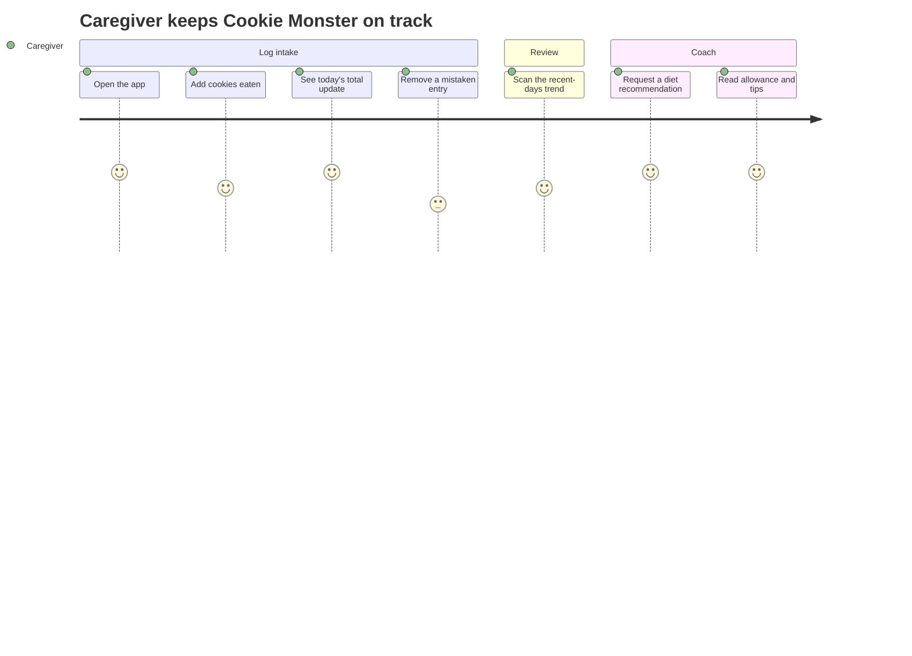
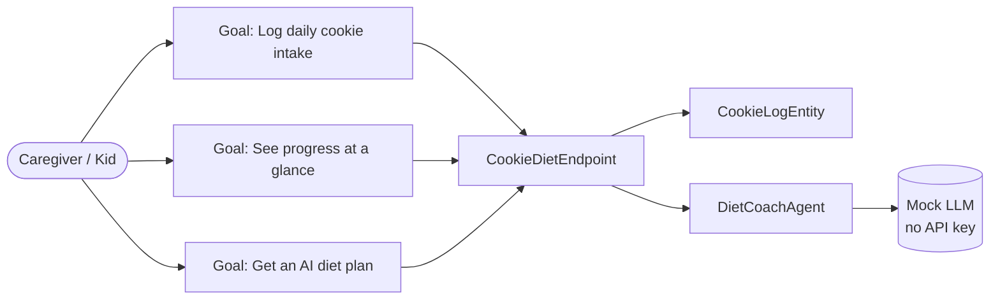
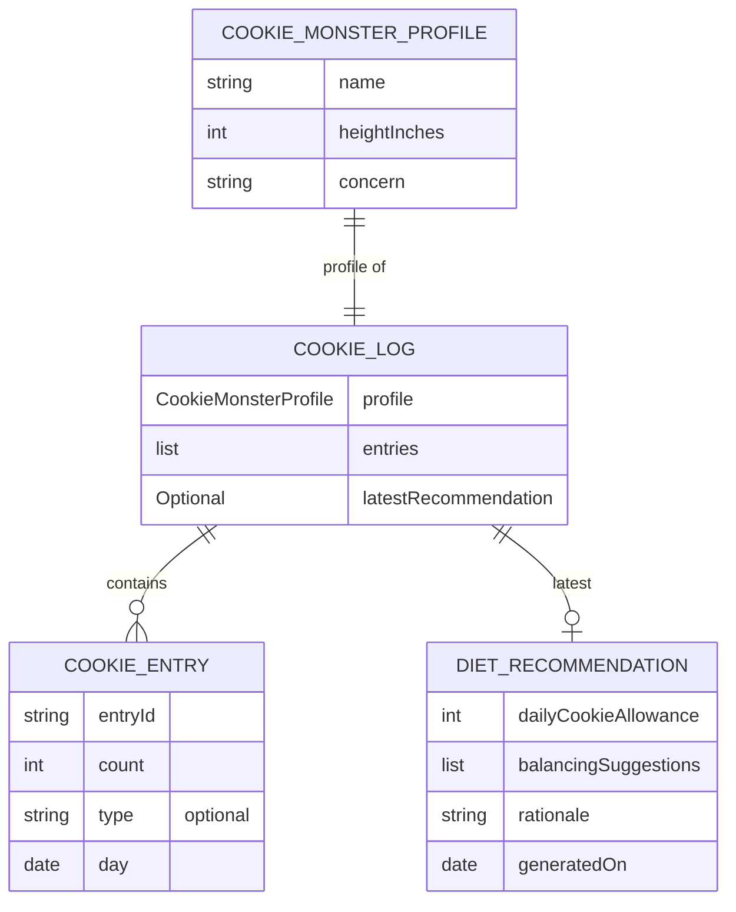
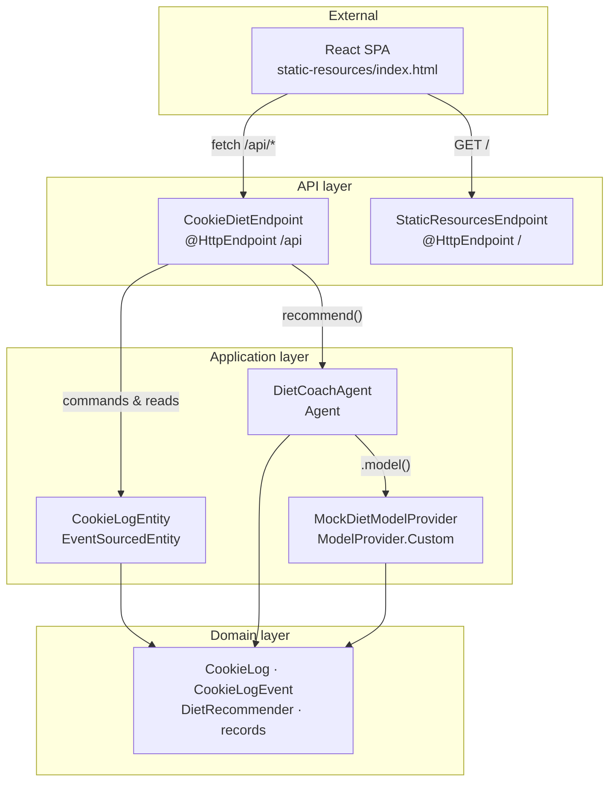
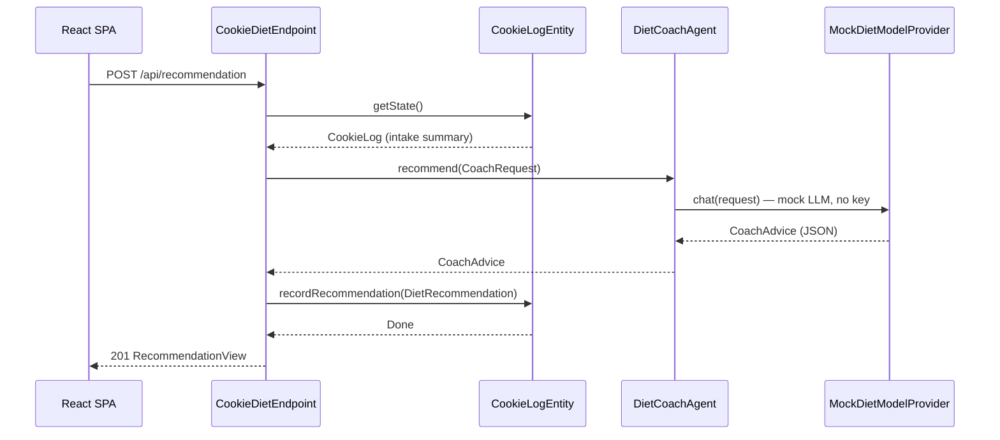

# Design Diagrams: Cookie Monster Cookie-Intake Tracker & AI Diet Coach

Five design views for the feature, as Mermaid sources. Rendered to
`docs/architecture.html` (inline SVG, offline) following the `/akka:demo` diagram rules.

## 1. User Journey

## 2. Actor-Goal

## 3. Entity Map

## 4. Component Graph

## 5. Sequence — Get a diet recommendation

